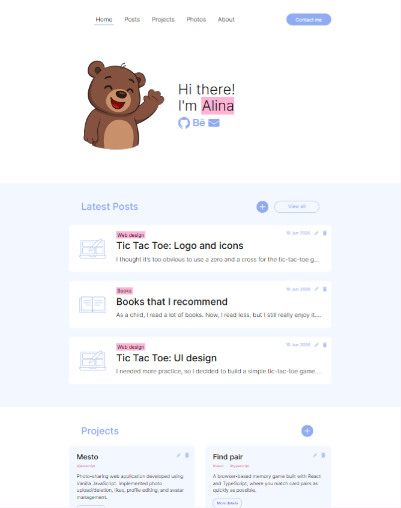
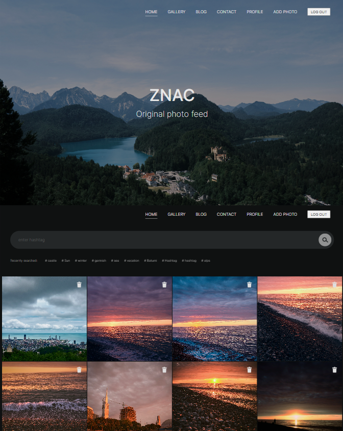
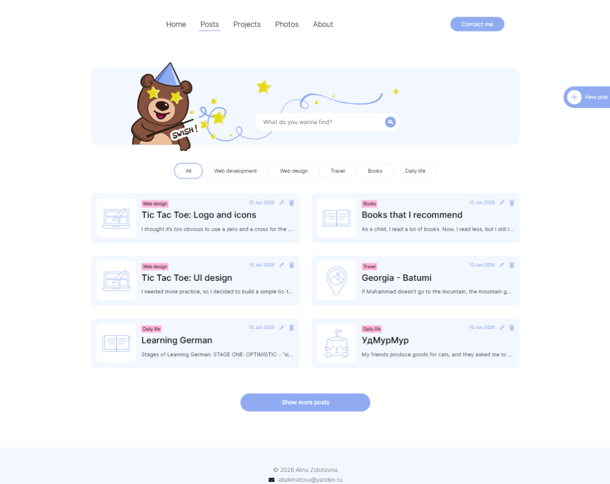
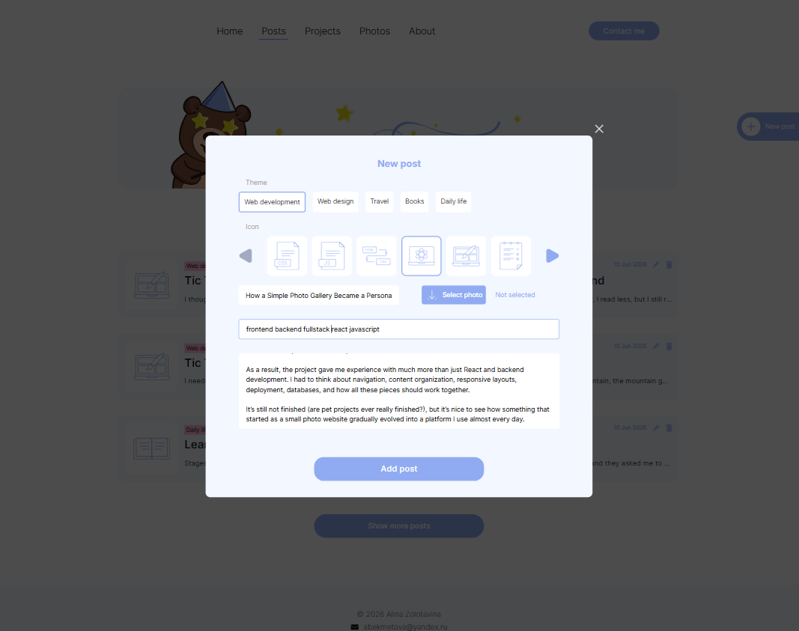

# ZNAC

Frontend application for ZNAC, a personal website that combines a portfolio, blog, photo gallery, and administration dashboard for content management.

Designed and developed independently, including UI/UX design, frontend architecture, implementation, deployment coordination, and ongoing maintenance.

## Demo

Live version: https://znac.org

## Screenshots

  
  

  
  

## Features

Content Management

- Create, edit, and delete blog posts
- Manage projects and portfolio entries
- Upload and organize photos
- Manage hashtags and categories

Authentication

- Secure login system
- Protected administration routes
- Profile management

Content Discovery

- Search functionality
- Category filtering
- Hashtag-based navigation

Responsive Experience

- Desktop
- Tablet
- Mobile

## Design highlights:

- Custom UI/UX design
- Responsive layouts
- Mobile-first approach
- Reusable components and modal system
- Consistent visual identity across all sections

Click here to see [Photo Gallery Design](https://www.figma.com/design/9Ope6gJMSxNlTgW2xmiadI/ZNAC-Photo-Gallery?node-id=0-1&t=LaVz5AllRF0P5ARz-1).

And here is [Blog & Portfolio Design](https://www.figma.com/design/nr7iR1eT478g28M8Mrc6BX/BLOG?node-id=0-1&t=F0lEJgBEDi8ssd8K-1).

## Architecture

The application is organized into reusable UI components and feature-based sections.

Main areas:

- Portfolio
- Blog
- Projects
- Photo Gallery
- Authentication
- Profile Management
- Administration Dashboard

The application communicates with a custom REST API and uses protected routes for authenticated areas.

## Technologies

- React
- React Router
- JavaScript (ES6+)
- HTML5
- CSS3
- REST API

## Related Repository

Backend API: [ZNAC API](https://github.com/AlinaZolotavina/znac-api)

## Deployment

Hosted on AWS Lightsail.

## Future Improvements

- Migration to TypeScript
- Performance optimization
- Accessibility improvements
- Additional automated testing
